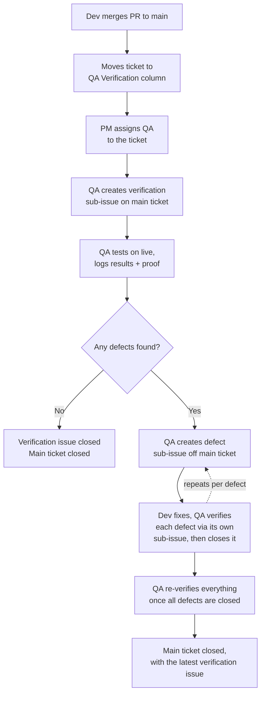

# Best Practices - *Zx!*

*We learn as a Team, we grow as a Team*

## Table of Contents

- [PR and QA Verification Process](#pr-and-qa-verification-process)
- [GitHub & Version Control](#github--version-control)
  - [Repository Structure](#repository-structure)
  - [Branching](#branching)
  - [Commits](#commits)
  - [Pull Requests](#pull-requests)
  - [Defects](#defects)
- [Code Quality](#code-quality)
  - [DRY Principles](#dry-principles)
  - [Naming Conventions](#naming-conventions)
  - [Styling](#styling)
  - [Technical Debt](#technical-debt)
- [Brainstorming & Planning](#brainstorming--planning)
- [Debugging](#debugging)
- [Logging](#logging)
- [Design](#design)
  - [Approach](#approach)
  - [Component Strategy by Project Type](#component-strategy-by-project-type)
  - [Design Implementation Rules](#design-implementation-rules)
- [Testing & QA](#testing--qa)
  - [QA Verification Process](#qa-verification-process)
  - [QA Coverage Flow](#qa-coverage-flow)
  - [Precautions](#precautions)
  - [Security Checks](#security-checks)
  - [Defect Reporting](#defect-reporting)
  - [Defect Verification](#defect-verification)
- [Project Management](#project-management)
  - [Sprint Planning](#sprint-planning)
  - [Retrospective](#retrospective)

---

## PR and QA Verification Process



---

## GitHub & Version Control

### Repository Structure

We follow a **monorepo** approach. All related projects and packages live within a single repository.

- Keeps shared code, tooling, and configurations in one place for easier maintenance.
- Enables atomic commits across multiple packages or apps when a change spans more than one area.
- Simplifies dependency management and ensures all teams are working from a consistent codebase.
- Use a clear directory structure (e.g., `apps/`, `packages/`, `libs/`) to separate concerns within the monorepo.

### Branching

- Always use feature branches for development work.
- Use a descriptive branch name that reflects the task or feature (e.g., `dev-username/feature/user-auth`, `dev-username/fix/login-bug`).
- Rebase feature branches to keep commit history linear and clean.
- Delete branches once they are merged and no longer used. Do not leave stale branches.

### Commits

Commits should be atomic, descriptive, and consistent.

- One logical change per commit.
- Avoid bundling unrelated changes.
- Use Conventional Commit messages, always beginning with a capital letter: `Feat:`, `Fix:`, `Chore:`, `Docs:`, `Refactor:`, `Test:`, etc.
- The commit message should clearly describe what changed and why.

**Example:** `Feat(auth): Add JWT token refresh logic`

### Pull Requests

**PR Template**

When creating a new PR, the description will automatically include a standard format with:

- Issue reference
- Description
- Implementation checklist
- Dev proof
- Notes

Use this format as provided and complete the checklist with all work included in the PR. Attach relevant proof (screenshots/recordings) for each completed item.

**PR Guidelines**

- Keep PRs small and focused. Prefer fast, iterative changes over large batches.
- Keep pull requests within a manageable size (maximum ~500 lines of changes) to ensure they remain easy to review.
- Changes should be broken down into granular, focused PRs rather than combining multiple unrelated updates into a single PR.
- Avoid PRs that are too small or too large, as both can reduce review quality and efficiency.
- For React-based changes, aim to keep PRs smaller where possible (ideally around 200-300 lines) to maintain review quality.
- Reviewers must leave at least one actionable comment or provide explicit approval.
- If the PR includes UI changes, reviewers must verify the implementation against the Figma design. The UI should match the approved Figma design.
- When review feedback is provided, ensure all requested changes are implemented, update the related review comments with appropriate responses, and resolve them once addressed.
- If anything looks unclear or incorrect, confirm with the PM or UI engineer before merging.
- Run all important checks locally before pushing.

### Defects

- Before picking up new work, always check the Defects column in the backlog for any open defect issues assigned to you.
- When fixing a defect, do not tag or reference the defect issue in the PR description or commit message.
- After the PR is merged, manually move the issue to the QA Verification column so the QA team knows it is ready for re-testing.

---

## Code Quality

### DRY Principles

Do not repeat yourself.

- Identify and eliminate duplication.
- Always reuse existing components. If a component is used in 2 or more places, lift it to the shared library.
- Write code that is usable for future work, not just the current task.

### Naming Conventions

Be explicit and consistent. Naming should be uniform across the entire project.

- Follow a single agreed convention and stick to it throughout (e.g., camelCase for variables and functions, PascalCase for components and types).
- Always start directory names with a capital letter (e.g., `Components/`, `Utils/`, `Hooks/`).
- Use nouns for types and data structures (e.g., `UserProfile`, `bookingList`).
- Use verbs for actions and functions (e.g., `fetchUser`, `handleSubmit`).
- Avoid abbreviations or ambiguous short names - clarity is more important than brevity.

### Styling

- Never hardcode color or spacing values; always use design tokens/variables.
- Store all shared styles in a central location and reference them consistently.
- Maintain a frontend structure reference in a markdown file within each repository for easy onboarding.

### Technical Debt

- Do not leave space for technical debt. Address issues as they arise.
- Keep the codebase clean, structured, and ready for future extension.
- If a shortcut or workaround is used due to time constraints, raise a GitHub Issue immediately and tag it `tech-debt` so it is tracked and not forgotten.
- Before marking a task as done, do a quick self-review. If something feels hacky or unclear, it probably needs a cleaner solution before it ships.

---

## Brainstorming & Planning

- Before starting implementation on any critical or complex feature, invest time in planning.
- Use paper, Excalidraw, or any mind-mapping tool to create a clear visual of the whole scenario.
- After drafting the plan, think critically about edge cases and possible failure states.
- Only begin implementation after considering the full picture.
- This step prevents costly rewrites and keeps the team aligned from the start.

---

## Debugging

Follow a structured approach to isolate and fix issues effectively.

- Identify whether the issue originates from the frontend or backend.
- Inspect the network tab to understand what requests and responses are happening.
- Use the `debugger` statement to step through code execution.
- Read the full stack trace before making assumptions.
- Reproduce the issue consistently. Identify the exact steps that trigger it.
- Before fixing, check if the broken code is reused elsewhere. Fixing it in one place may affect other areas.

---

## Logging

Good logging enables faster debugging and better visibility into system health.

- Use a consistent logging pattern across the codebase (recommended: [Winston](https://github.com/winstonjs/winston)).
- Every log line should follow this structure:

  ```
  DATE TIMESTAMP: [THREAD] [MODULE] IP | USER - description of what happened
  ```

- Include the full stack trace for errors.
- Log meaningful events: errors, warnings, and important state transitions; not noise.

---

## Design

### Approach

- Begin every project with a defined design system. Establish primitives (colors, spacing, typography, base components) before building screens.
- Standardise recurring UI patterns early: notifications, states, flows; avoid redesigning the same component multiple times.
- Always align with the team on requirements and UX decisions before proceeding to design or implementation.
- Communicate UX decisions and trade-offs clearly to stakeholders to reduce unnecessary back-and-forth.

### Component Strategy by Project Type

Choose the right component approach based on the project's scope and timeline:

| Project Type | Recommended Approach | Rationale |
|---|---|---|
| Short-term projects | Build primitive components, wrap with a library (e.g., PrimeReact) | Faster delivery; library handles complex behaviours out of the box |
| Long-term / highly customised projects | Build fully owned design components (use the design system) | Greater flexibility, no third-party constraints, easier to scale and customise |

### Design Implementation Rules

- Create primary/primitive components first. Reuse them throughout the project.
- Before building a component, ask: *Should this be a primitive?* If it will be reused, make it one.
- When a PR includes UI changes, the reviewer must compare the implementation against the Figma design. It must match exactly.
- If anything is unclear or looks wrong, confirm with the PM or UI engineer before merging. This applies to all PRs.

---

## Testing & QA

### QA Verification Process

For every development ticket, create a separate QA Verification sub-ticket using the defined QA verification format.

The QA verification sub-ticket should include:

- Verification checklist
- Testing details
- Relevant proofs (screenshots/recordings)
- Any additional notes required for validation

Once the related PR is merged into the main branch, QA should verify the implementation on the live environment against the QA checklist.

**QA must:**

- Complete the verification checklist.
- Attach relevant proof for each verified item.
- Confirm the implementation matches the expected requirements.
- Close the QA verification sub-ticket once everything has been successfully verified.

**If any issue is found during verification:**

- Keep the QA verification sub-ticket open.
- Create a defect ticket as a sub-issue with clear details.
- Notify the relevant developer with the required information.
- Move the issue through the defect tracking process until resolved.

> **Important:** A main ticket should only be marked as completed after the related QA verification sub-ticket has been successfully verified and closed. A merged PR alone does not indicate ticket completion.

### QA Coverage Flow

1. **Functional testing** → ensure features behave as specified.
2. **UI/UX testing** → verify visual accuracy and user experience.
3. **Test automation** → use Playwright for automated end-to-end tests.
4. **Security testing** → run OWASP ZAP scans.
5. **Resilience & load testing** → use Artillery.

### Precautions

- Define a set of realistic personas before beginning the testing process.
- Use authentic details such as real names, real images, and contextually relevant information for each persona.
- Maintain consistency by using the same personas throughout the testing lifecycle.
- Avoid using unrealistic or exaggerated names, as well as cartoonish or animated images and content.

### Security Checks

- QAs must verify: the backend should never return more data than is necessary to render the frontend view.
- Any over-exposure of data from the API should be flagged as a defect.

### Defect Reporting

- Log all defects as GitHub Issues in the Defects column.
- If there are many defects, categorise them clearly for prioritisation and tracking.

### Defect Verification

- When a defect lands in the QA Verification column, it means the fix has been merged and is ready for re-testing.
- Re-verify the fix thoroughly against the original defect report.
- If the fix is confirmed, close the issue.
- If the issue still exists or something else has broken as a result, do not close it; inform the relevant developer directly with clear details on what still needs attention, and move it back to the Defects column.

---

## Project Management

### Sprint Planning

- Held on the first day of every sprint (approximately 1-2 hours).
- The whole team participates: development and QA.
- Break down sprint items collaboratively and estimate both dev time and QA time.
- Ensure tasks are realistic and clearly scoped before the sprint begins.

### Retrospective

- Held on the last day of every sprint; all team members must attend.
- The retrospective covers:
  - Were all assigned tasks completed?
  - If not, what caused the delays?
  - Was the workload appropriate, too light, or too heavy?
- This session feeds directly into better planning for the next sprint.
